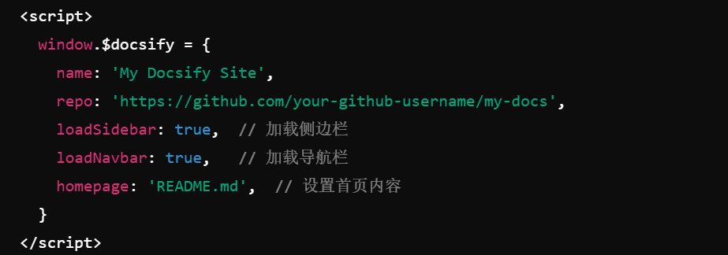

# 个人笔记库部署学习

1. 下载node.js
   Node.js 是运行在服务端的 JavaScript，下载LTS版本，安装 Node.js 后会自动安装 npm（Node Package Manager）
   检测有没有装好：

   ~~~
   node -v
   npm -v
   ~~~

2. 利用npm下载docsify
   Docsify 是一种轻量级的文档网站生成器，可以使用 Markdown 文件快速创建美观的文档网站。它不需要任何构建过程，只需将 Markdown 文件放在一个目录中，并使用 Docsify 启动器运行。

~~~bash
npm i docsify-cli -g
~~~

全局安装需要管理员权限，安装有问题尝试换源

~~~
npm config set registry https://registry.npmmirror.com/
~~~

3. 把github仓库clone到本地

   在克隆的仓库中初始化 docsify，会生成index.html文件

~~~bash
docsify init .	
~~~

编辑生成的index.html，自定义了name、repo、是否加载侧边栏、导航栏、首页内容部分

4. 在文件夹根目录下用

   ~~~bash
   docsify serve .
   ~~~

   意思是启动本地服务器，会生成一个Listening at 信息，从后面的网址进入（访问本地服务器），可以看到你的笔记结构，只要不退出这个命令，此时在笔记库里的任何更改在保存后都会显示在这个静态网页上。这一步可以进行本地的预览和调试

5. 上传到git仓库

   ~~~bash
   git add .
   git commit -m "Initialize docsify site"
   git push origin main
   ~~~

6. git里面设置pages托管页面，会生成可以从任何设备访问的网址（但是需要翻墙）

------

在本地设置的内容，项目根目录下可以使用两个md文件来分别定义侧边栏内容和顶部导航栏的内容。格式如下：

~~~bash
<!-- _sidebar.md -->
- [首页](README.md)
- [指南](guide.md)
- [API 文档](api.md)
- [关于我](about.md)

<!-- _navbar.md -->
- [首页](/)
- [文档](guide.md)
- [GitHub](https://github.com/your-github-username/my-docs)

~~~

就是一个简单的md文档，里面跳转用的是链接的方法，链接到本地的笔记文本就写相对路径，链接到某个网页内容就写绝对路径。为了使得本地图片在网页上可见，要把它放在这个项目下的某个路径。

------

尝试上传git第一步遇到了问题：

~~~bash
warning: in the working copy of 'index.html', LF will be replaced by CRLF the next time Git touches it
~~~

这个提示是关于行尾符号格式的警告信息,不是一个严重的问题，但了解它的含义有助于避免潜在的兼容性问题。

**LF (Line Feed)**：这是 UNIX 和 Linux 系统（包括 macOS）默认使用的换行符。

**CRLF (Carriage Return + Line Feed)**：这是 Windows 系统默认使用的换行符。

它可能会在以下情况下产生影响：

- **跨平台协作**：如果你在一个团队中工作，且团队成员使用不同的操作系统（如 Windows 和 macOS），行尾符号的转换可能会导致文件在不同系统之间的版本不同。
- **自动化脚本和工具**：有些自动化脚本或工具可能对换行符敏感，可能会因为行尾符的变化而出现问题。

**解决方法：**

1. 在项目根目录下配置.gitattributes文件，里面有`* text=auto`，如果只针对html文件就写`*.html text eol=lf`，意思是让git根据操作系统自动处理行尾符，或者始终使用LF换行符

2. 可以在命令行里进行全局git设置

   ~~~bash
   git config --global core.autocrlf true
   ~~~

   作用是在 Windows 上自动将 CRLF 转换为 LF 提交到 Git 库中，并在检出时将 LF 转换回 CRLF

其他选项还有：

- `core.autocrlf false`：Git 不会进行自动转换，文件保留原样。
- `core.autocrlf input`：只在提交时将 CRLF 转换为 LF，检出时保持 LF。

------

尝试push到远程仓库，又遇到了问题

~~~bash
warning: ----------------- SECURITY WARNING ----------------
warning: | TLS certificate verification has been disabled! |
warning: ---------------------------------------------------
warning: HTTPS connections may not be secure. See https://aka.ms/gcm/tlsverify for more information.
warning: ----------------- SECURITY WARNING ----------------
warning: | TLS certificate verification has been disabled! |
warning: ---------------------------------------------------
warning: HTTPS connections may not be secure. See https://aka.ms/gcm/tlsverify for more information.
~~~

是关于 **TLS（传输层安全性）证书验证**的一个 **安全风险** 提示，说明你的 Git 设置已经 **禁用了 TLS 证书验证**。这种配置会使你的 HTTPS 连接不再进行安全验证，从而存在一定的安全风险。

禁用了验证意味着连接可能会受到中间人攻击，因为Git不会验证它连接的服务器是否真实，出现的原因有

1. **临时禁用了证书验证**：有时，开发者可能为了绕过证书问题（如自签名证书或过期证书）而临时禁用了证书验证。
2. **使用了错误的配置**：手动设置了 `git config` 中的 `http.sslVerify` 为 `false`

我们的解决方法：

